# OOP Lab 0

## Table of contents
* [Installing Ubuntu](#installing)
* [Instaling Essential Tools](#tools)
* [Creating the Git Repository](#git)


## Installing Ubuntu <a name='installing'></a>
First step was to create a disk partition for **Ubuntu**. I wanted to allocate 100Gb for **Ubuntu**. 
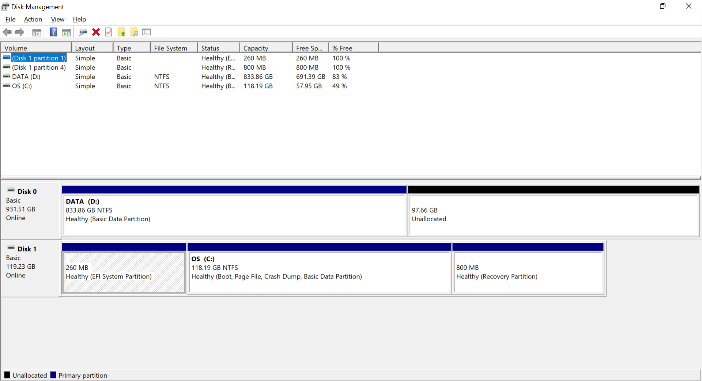
After I had created the partition, I downloaded **Ubuntu** and **Rufus**. With the help of **Rufus**, I created a bootable USB 
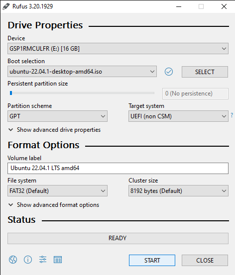\
Then I had restarted the laptop and entered the Boot Menu where I installed **Ubuntu** from the USB.
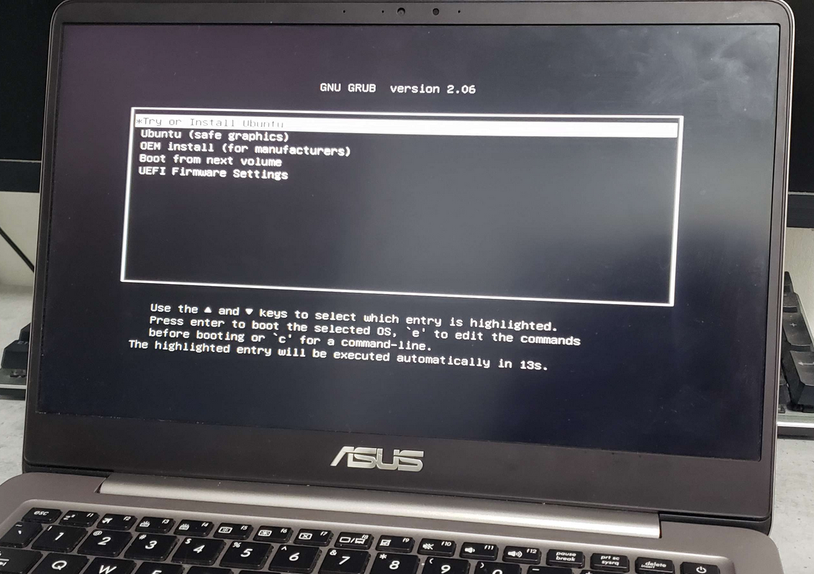
I had chosen custom install and then created disk partitions for *root* and *swap*.
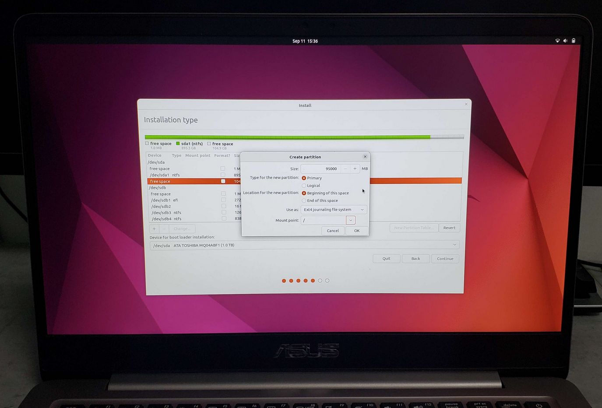
## Instaling Essential Tools <a name='tools'></a>
In order to install zsh, I used the command 
```console
sudo apt-get install zsh.
```
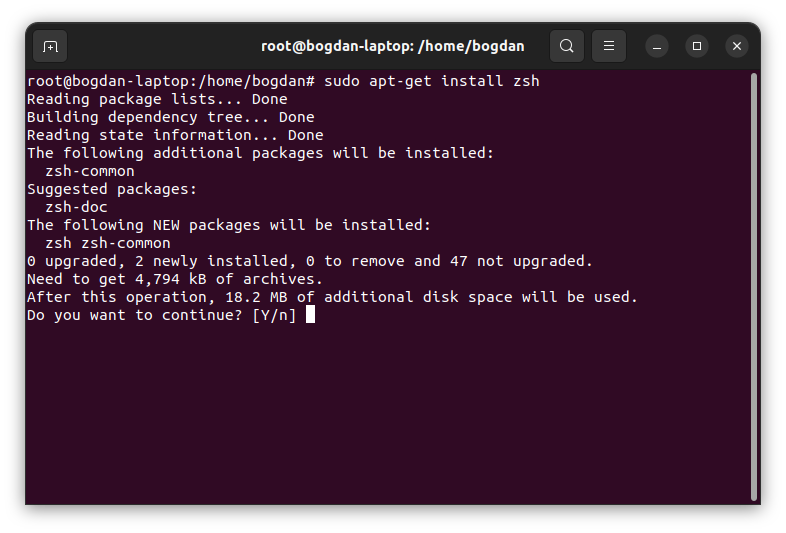\
To change the login shell from *bash* to *zsh*, I used the command *chsc* and indicated the new path for login shell as  **/bin/zsh**.
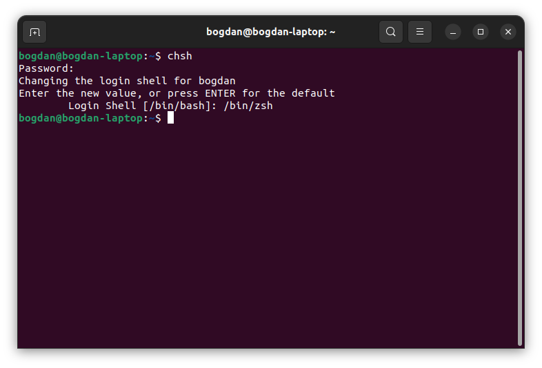

Before installing **oh-my-zsh**, I had to install **curl**, using the command 
```console
sudo apt install curl
```
and **git**, using 
```console
sudo apt install git
```
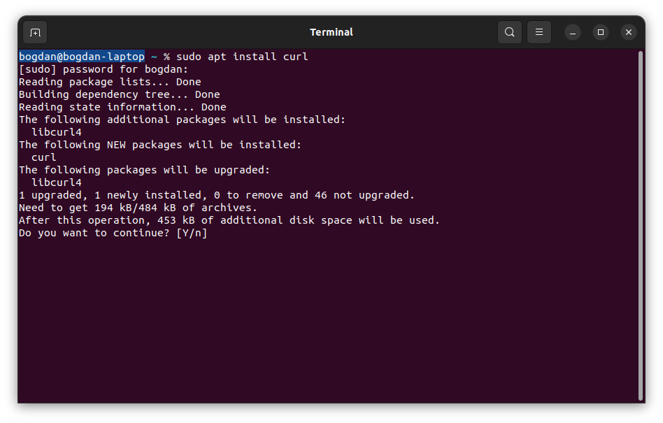
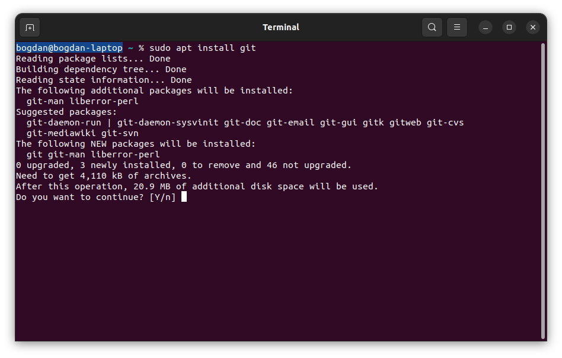
Then I installed **oh-my-zsh** using the command
```console
sh -c "$(curl -fsSL https://raw.github.com/ohmyzsh/ohmyzsh/master/tools/install.sh)" 
```
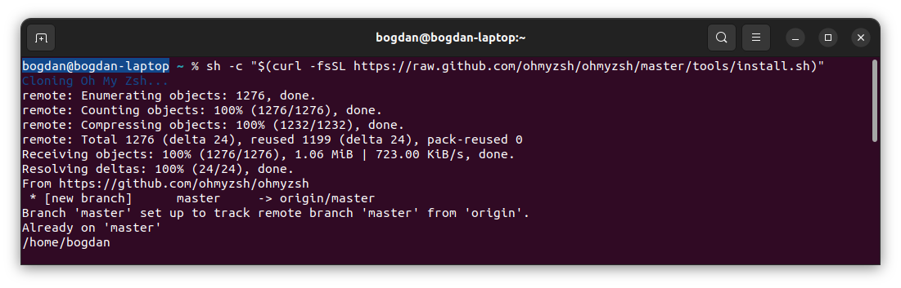
Next step was to change the zsh theme from the default one *(robbyrussell)* to **powerlevel10k**.  Firstly, I used the command
```console
git clone --depth=1 https://github.com/romkatv/powerlevel10k.git ${ZSH_CUSTOM:-$HOME/.oh-my-zsh/custom}/themes/powerlevel10k
```
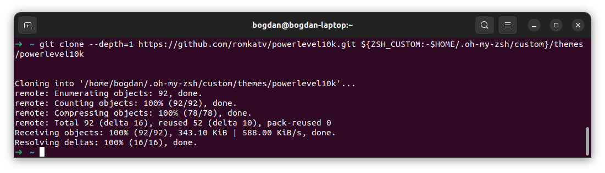
Next step was to set it as default zsh theme, so I used the command code **~/.zshrc** that opened this file for editing and set 
*ZSH_THEME="robbyrussell"* to *ZSH_THEME="powerlevel10k/powerlevel10k"* 
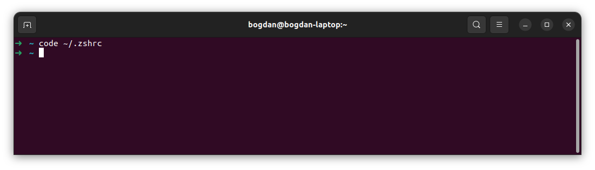
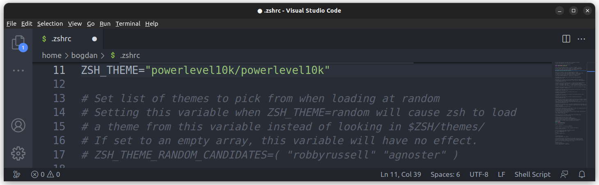
After that, I used the command 
```console 
p10k configure
``` 
and configured the theme.\
Also, I used some commands to edit some basic **Git** configurations.
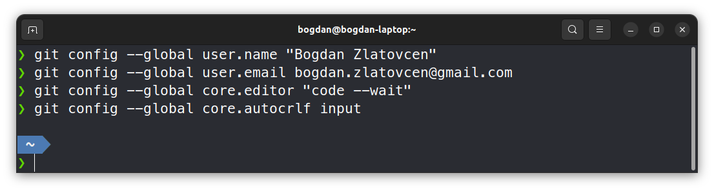
I checked if gcc was preinstalled using **gcc --version**, and actually it wasn't. So I used the command 
```console
sudo apt install build-essential
```
, which installed both *gcc* and *g++*, and also some other essential packages.
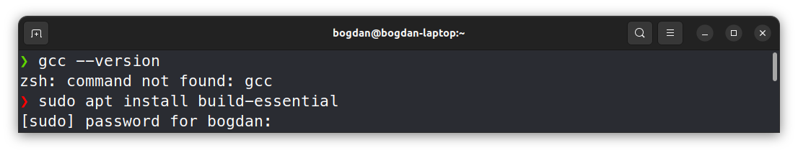
## Creating the Git Repository <a name='git'></a>
First step was to clone the repository created on Github, using the command 
```console
git clone
```
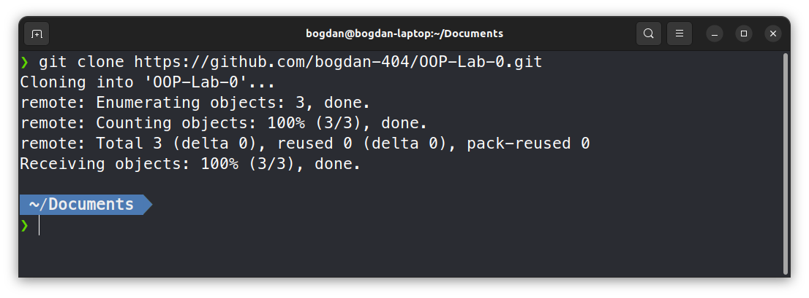
Next step was to create the **hello.c** file and edit it using *nano* command
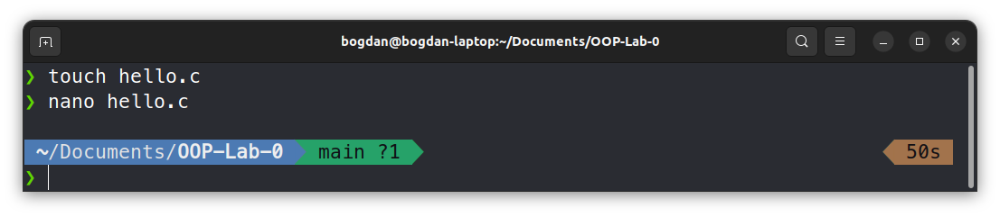
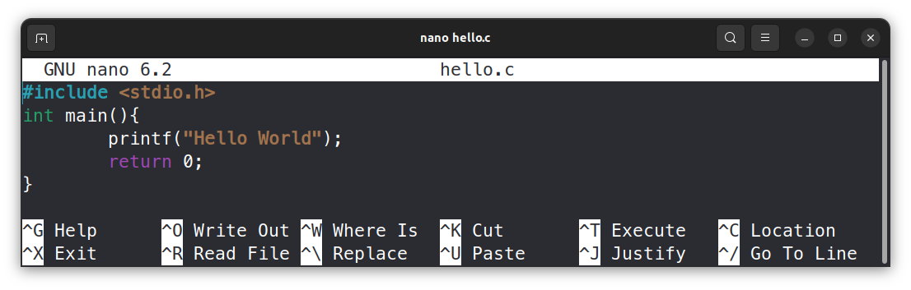

### Compiling using gcc:
We firstly compile **hello.c** and get an output file (hello). Then we execute the output file 
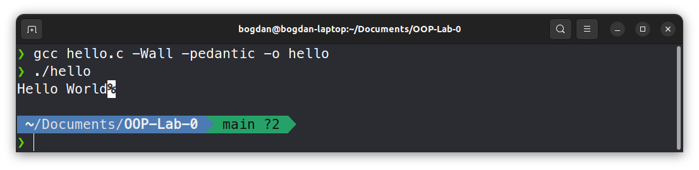

### Compiling using Makefile:
We firstly create a file named **Makefile** and edit it using *nano* command. Then we execute the output file 
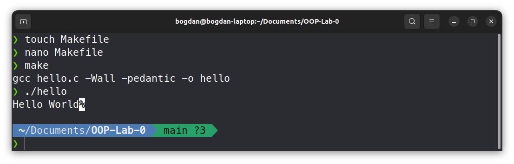
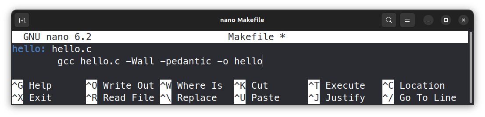
After removing output file, I had added all files to stage area on git, and then made the first commit and pushed it to the remote repository
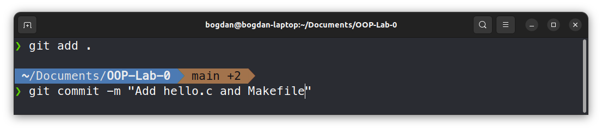
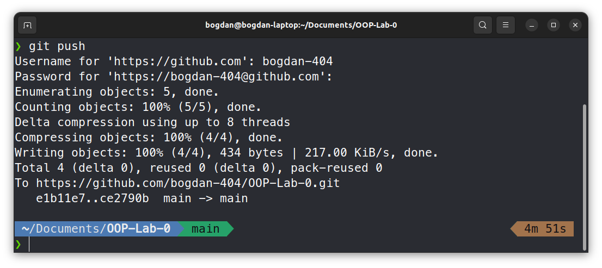
After working with source code and **Makefile**, I had to add the directory with screenshots to the local repository, using *cp* command
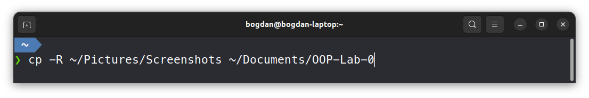
Last step was to edit the README.md file using the command *nano*, and of course to make the last commit and push it to the remote repository
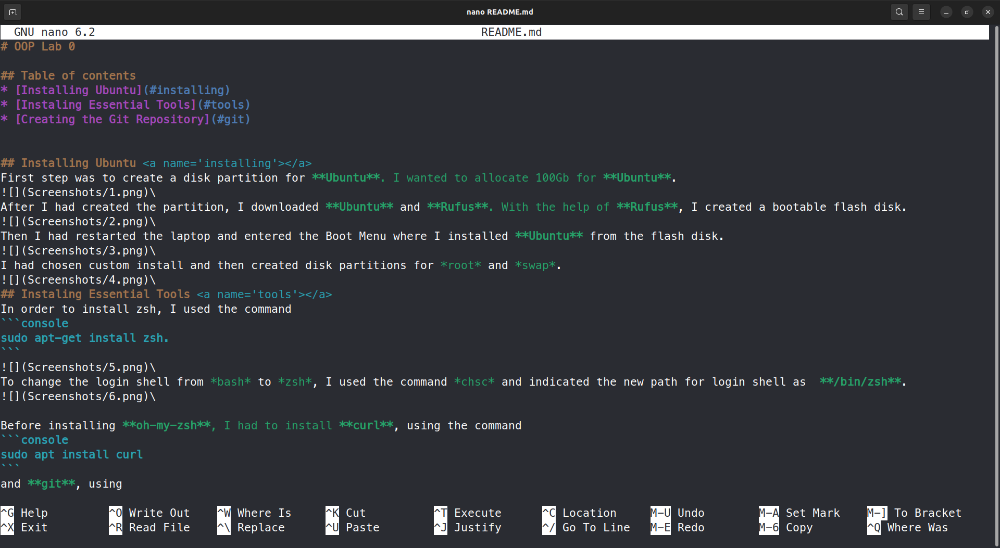