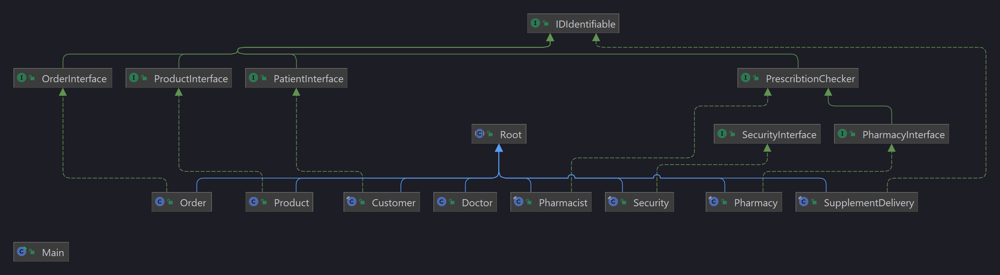

# OOP-Lab-4

## Hierarchy

## Scenarios

- Client orders products which do not need a prescribtion
  - Product in stock
  - Product in sock but less than the client need
  - Product out of stock
- Client orders products which need a prescribtion
  - Client has prescribtion
  - Client doesn't have a prescribtion
- Client tries to rob the pharmacy
  - Robber is arrested (80% chance)
  - Robber takes everything from the cash register (20% chance)
