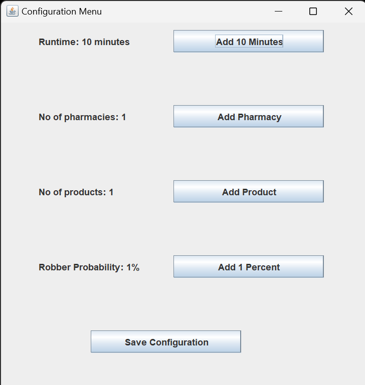
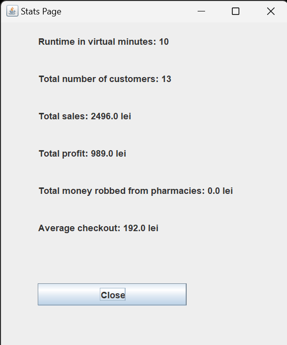

# OOP Lab 6: MVC

## Model

The model is represented by all the classes from the previous laboratory.

## Controller

We have only one instance of the controller. I used the MVC architecture, so the controller operates with model and view packages.

## View

For GUI I used JFrame. We have 2 instances for view: Configuration Menu and Stats Page.

### Configuration Menu

### Stats Page

